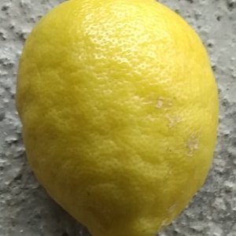

# Lemon Quality Classification

This project aims to classify the quality of lemons into three categories: bad, good, and empty background. The model is trained using a convolutional neural network (ResNet) implemented in PyTorch.

## Dataset

The dataset used for training, validation, and testing consists of images of lemons with different qualities. The dataset is organized into three folders: `bad_lemons`, `good_lemons`, and `empty_background`.

Here are some sample images from each class:

|  |  |  |
|:------------------------------------:|:-------------------------------------:|:------------------------------------------------:|
|           Bad Lemon                   |            Good Lemon                  |             Empty Background                     |

## Model Architecture

The model architecture used for this classification task is ResNet-50. It is a widely-used convolutional neural network architecture known for its excellent performance on image classification tasks. The final fully connected layer of the model is replaced to match the number of classes in the dataset.

## Training

During training, the model is trained using the Adam optimizer and cross-entropy loss. The training process involves iterating over the training dataset for a specified number of epochs. The progress and performance metrics, such as loss and accuracy, are displayed using the tqdm library.

The trained model achieved an accuracy of 99.49% on the training set.

## Testing

The trained model is evaluated on a separate test dataset. The test accuracy achieved by the model was 98.95%.

## Usage

To use this project, you can follow these steps:

1. Clone the repository:

2. Download the trained model weights (model.pth) from the release section.

3. Open the train notebook (train.ipynb) and run it to train the model. Make sure to modify the file paths for the dataset and checkpoint saving accordingly.

4. Open the test notebook (test.ipynb) and run it to evaluate the trained model on the test dataset. Again, make sure to modify the file paths for the dataset and model weights accordingly.

Feel free to experiment with the trained model and adapt it for your own use cases!

## Acknowledgments

- The dataset used in this project was collected from a publicly available source. [Click here](https://www.kaggle.com/datasets/yusufemir/lemon-quality-dataset) to access the dataset.
